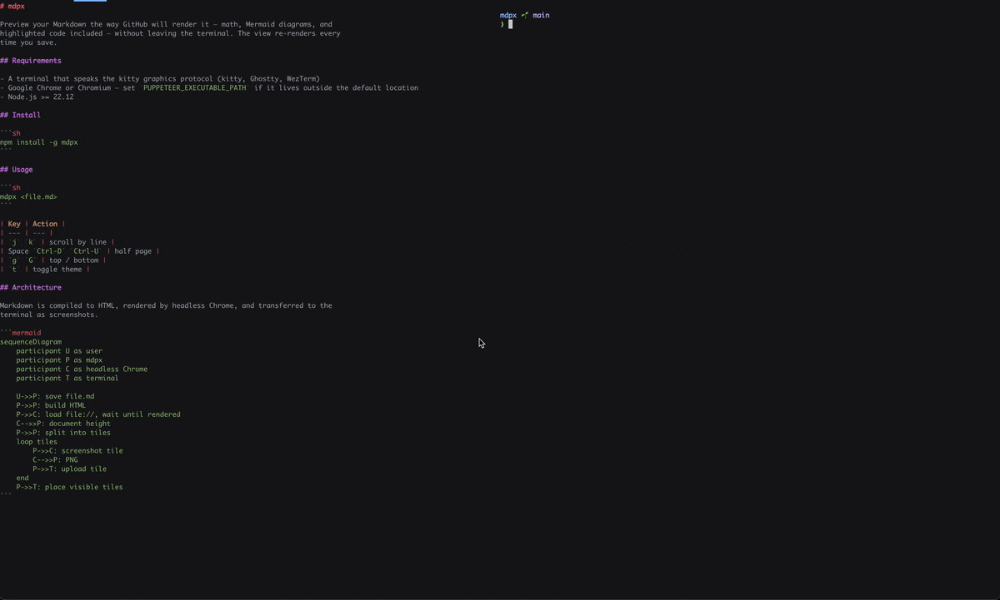
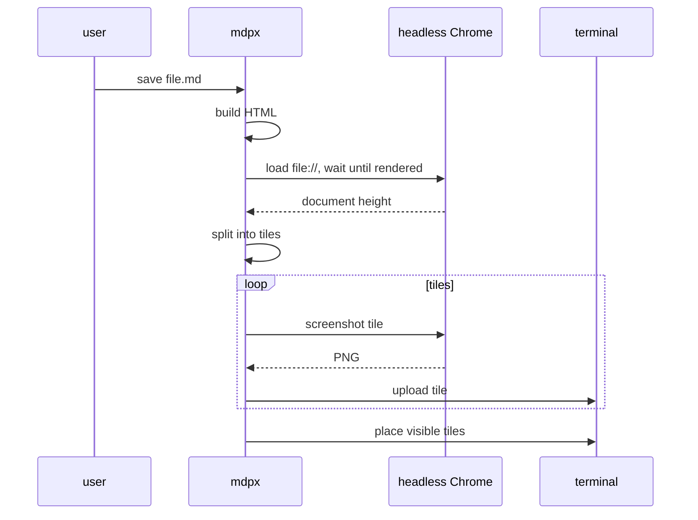

# mdpx

Preview your Markdown the way GitHub will render it — math, Mermaid diagrams, and
highlighted code included — without leaving the terminal. The view re-renders every
time you save.



## Requirements

- A terminal that speaks the kitty graphics protocol (kitty, Ghostty, WezTerm)
- Google Chrome or Chromium — set `PUPPETEER_EXECUTABLE_PATH` if it lives outside the default location
- Node.js >= 22.12

## Install

```sh
npm install -g mdpx-cli
```

## Usage

```sh
mdpx <file.md>
```

| Key | Action |
| --- | --- |
| `j` `k` | scroll by line |
| Space `Ctrl-D` `Ctrl-U` | half page |
| `g` `G` | top / bottom |
| `t` | toggle theme |

## Architecture

Markdown is compiled to HTML, rendered by headless Chrome, and transferred to the
terminal as screenshots.


