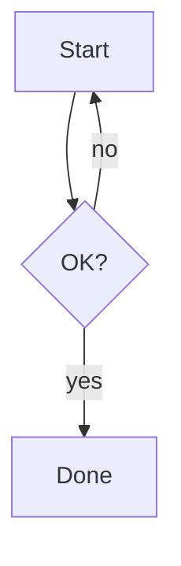

# mdv fixture

Paragraph text with **bold**, `inline code`, and ~~strikethrough~~,
continued on a second source line of the same paragraph.

## Math (KaTeX SSR)

Inline $E = mc^2$ and a block:

$$
\int_0^\infty e^{-x^2}\,dx = \frac{\sqrt{\pi}}{2}
$$

## Diagram (Mermaid)



## Code (shiki)

```ts
function add(a: number, b: number): number {
  return a + b;
}
```

## Table

| Name | Value |
|------|-------|
| foo  | 1     |
| bar  | 2     |

## Tasks

- [x] done
- [ ] todo

## Image


## CJK glyphs

日本語の段落。全角と半角が混在しても行送りが崩れないことを目視で確かめる。
